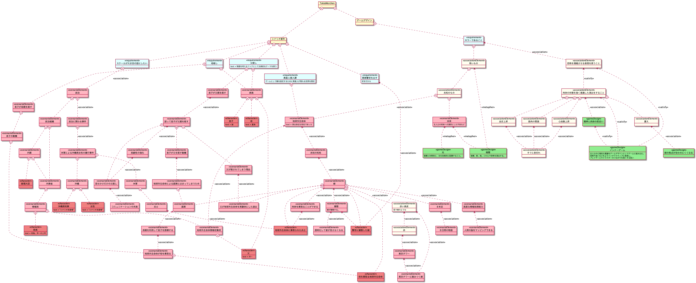
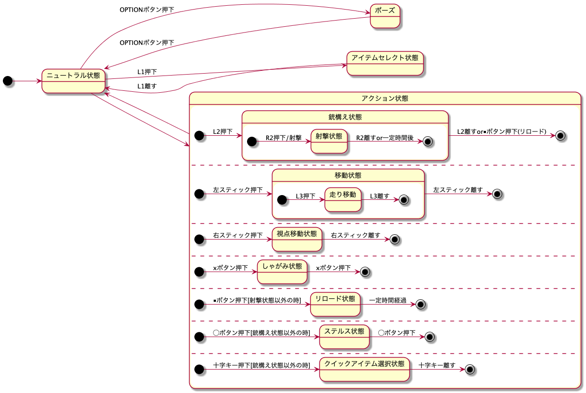
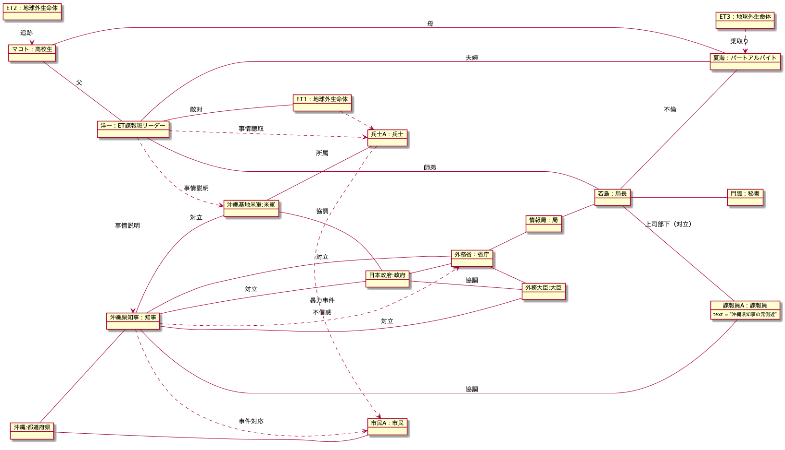

# 『TokioMarchen』企画書
『TokioMarchen』というゲームの企画書とシナリオです。

各フォルダとファイルの内容は下記の通りです。

|フォルダ又はファイル名     |内容                                             ｜
|------------------------|------------------------------------------------|
|img                     |README.mdで使用している画像ファイルが収められています。|
|pdf                     |README.mdで使用しているPDFファイルが収められています。|
|LICENSE                 |ライセンスに関する規定です。                          |
|README.md               |当ファイルです。『TokioMarchen』の概要が記されています|
|ScenarioTokioMarchen.pdf|『TokioMarchen』というシナリオ本編です。           |

 

## はじめに
この資料には、おおまかに言うと、

- ゲームの概要
- 要求仕様
- ゲームデザイン
- シナリオ

が記述されています。 

 

## 目次
<a href="#Title">1.タイトル</a>
 
<a href="#Purpose">2.ゲームの概要</a>
 
<a href="#HorrorAction">&nbsp;&nbsp;&nbsp;2.1.ジャンル</a>
 
<a href="#Story">&nbsp;&nbsp;&nbsp;2.2.ストーリー</a>
 
<a href="#Requirement">3.『TokioMarchen』要求仕様</a>
 
<a href="#GameDesign">4.ゲームデザイン</a>
 
<a href="#Scenario">5.シナリオ</a>
 
<a href="#ScenarioAbstract">&nbsp;&nbsp;&nbsp;5.1.概要</a>
 
<a href="#ScenarioMain">&nbsp;&nbsp;&nbsp;5.2.本編</a>
 
<a href="#Sokan">&nbsp;&nbsp;&nbsp;5.3.相関図</a>
 
<a href="#Act">&nbsp;&nbsp;&nbsp;5.4.主要登場人物アクション（時系列）</a>
 
 

## 1.タイトル
Tokio Marchen

 

## 2.ゲームの概要

### 2.1.ジャンル
ホラーアクション 

### 2.2.ストーリー
18歳の少年に起こる悲劇である。 
少年は、「見せかけだけの父殺し」をすることで、見せかけだけ父を乗り越える。少年は、誤って父を殺してしまったことを悟り、最後はなんとか母だけでも取り戻そうとするが、それすらかなわない。少年は必死でもがいていたつもりでも、真実は少年の手のひらからこぼれていく。

 

## 3.『TokioMarchen』要求仕様
一番はじめの要求は下記の通りであった。 

- スケールが大き目の話にしたい
- 母殺し
- 父殺し
- 異星人侵入譚
- 悪徳警官を出す
- ホラーであること

最終的な要求図は下記のようになった。 
なお下記の図は、物語のキーとなる要素や登場人物などを色分けし、わかりやすく図示している。 

 
 
なお、要求図の要素には次のようなものを定義した。

|要素種別           |意味                           |色        |
|------------------|------------------------------|----------|
|requirement       |要求                          |ライトブルー |
|scenarioElement   |シナリオで使用できそうな要素      |ピンク     |
|character         |シナリオに登場するキャラクター     |レッド     |
|gameDesign        |ゲームデザインの肝になりそうな要素 |グリーン    |
|associationElement|要求図作成時に連想した要素        |ペールホワイト|

 

## 4.ゲームデザイン
一般的なガンアクションシューティングを想定している。
主なアクションは下記のようなものを想定している。

|操作方法           |コントローラー             |
|------------------|------------------------|
|通常移動           |左スティック              |
|走り移動           |L3押し込みながら左スティック|
|視点移動           |右スティック              |
|銃を構える         |L2                       |
|銃を撃つ           |R2                       |
|しゃがみ           |Xボタン                  |
|リロード            |⬜︎ボタン                |
|ステルス状態         |○ボタン                |
|クイックアイテム選択  |十字キー               |

 
状態遷移図だと下記のようなイメージである。

 

## 5.シナリオ
要求図をヒントにシナリオの作成を行なった。

### 5.1.概要
異星人侵入譚をベースに、文学的なフレーバーとして父殺し（母殺し）の枠組みを導入する。また、父殺しだけだと家族内の話に終始してしまうため、政治的な要素をシナリオに組み込み、話のスケールを少しでも大きくするものとする。

### 5.2.本編
シナリオ本編は、『<a href="./ScenarioTokioMarchen.pdf">ScenarioTokioMarchen.pdf</a>』を参照すること。

### 5.3.相関図
シナリオより導かれた各登場人物や組織などの相関図を下記に示す。

 

### 5.4.主要登場人物アクション（時系列）
主要登場人物のアクションを時系列で整理した資料『<a href="./pdf/ActChronologicalOrder.pdf">ActChronologicalOrder.pdf</a>』を用意した。 
前日譚や大まかな流れを確認する際は、この資料を参考にすること。

